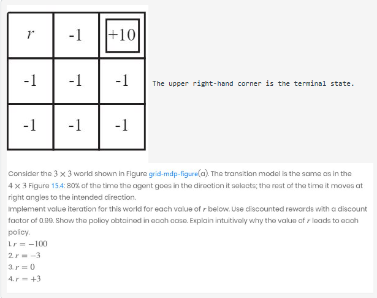

# Grid Environment MDP Simulation

This project simulates a Markov Decision Process(MDP) within a grid environment. It uses the value iteration algorithm to find different policies for various values of r (see problem statement for clarification on r) with a discount discount factor (gamma) of 0.99. This reposititory was created for educational purposes, specifically for my 3rd assignment in CAP6635 - Advanced AI at the University of North Florida, taught by Dr. Ayan Dutta.

## Features
- Grid Environment: A customizable grid where each cell represents a state in the MDP.
- Actions: Four possible actions (up, down, left, right) that an agent can take from each state.
- Rewards: Default reward for each state can be set, additionally, a seperate special state, and the terminal state's rewards can be specified seperately.
- Value Iteration: Implementation of the Value Iteration algorithm to find the optimal policy for each state based on the expected utility and varying r values. See problem statement for what r is.
- Visualization: Functions to visualize the reward grid, utility grid, and policy grid at various stages of the algorithm for different r values through the command line.

## Problem Statement

## Requirements
Python 3.x

Note: No third party libraries such as numpy were used, project only uses the standard random library.

## Usage
- Configuration: Before running the script, grid dimensions, default reward values, the terminal state reward, and the different r values can be configured within the main function of the script. The current configuration is simply set to address the problem statement of this project.
- Running the Script: Enter `python main.py` in a terminal or command prompt
- Output: The script will print the initial reward grid, utility grid, and policy grid for each r value. After performing value iteration, it will also print the optimized utility grid and policy grid for that r value, demonstrating how the agent should navigate the grid to maximize rewards (according to the value iteration algorithm under this configuration).

### Example Output

## Customization
To experiment with different grid sizes, modify the `grid_width` and `grid_height` variables in the main() function.
To adjust the default reward for non-terminal states, change the `initial_reward_value`.
To set different rewards for the terminal state and a specific state with varying reward, modify the `terminal_state_reward` and the `r_values` list, respectively.

## Customization
- To experiment with different grid sizes, modify the `grid_width` and `grid_height` variables in the main() function.
- To adjust the default reward for non-terminal states, change the `initial_reward_value`.
- To set different rewards for the terminal state and a specific state with varying reward, modify the `terminal_state_reward` and the `r_values list`, respectively.

## Note
This script is intended for educational purposes and not intended to be used an industry tool as it is not optimized for performance or scalability. 

# Closing remarks
Please feel free to let me know about any errors you may discovered or mistakes I may have made while creating this project. Additionally, I hope you find it useful.